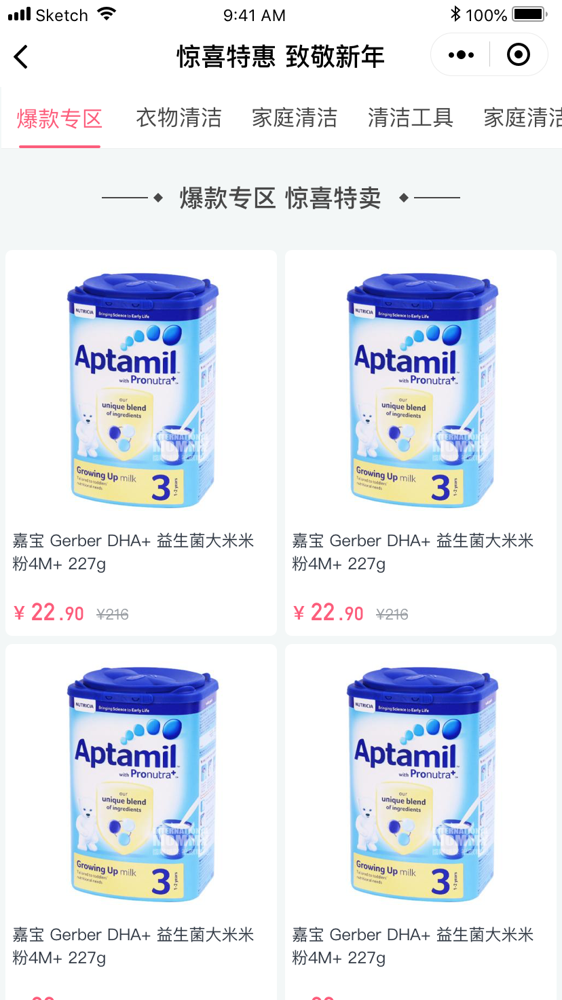
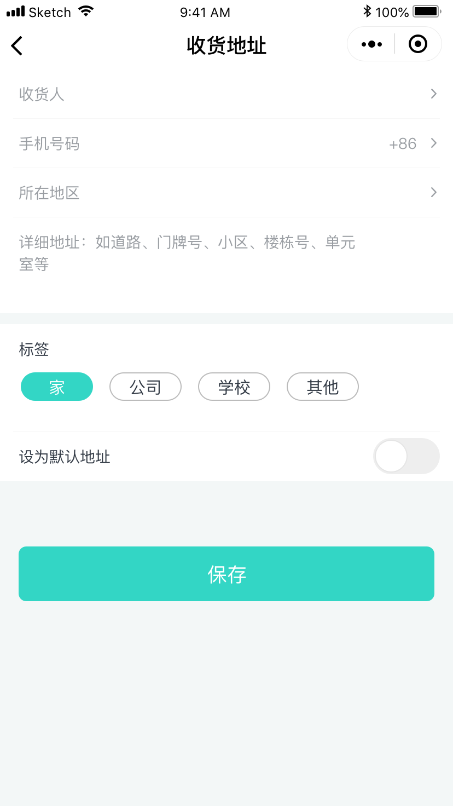
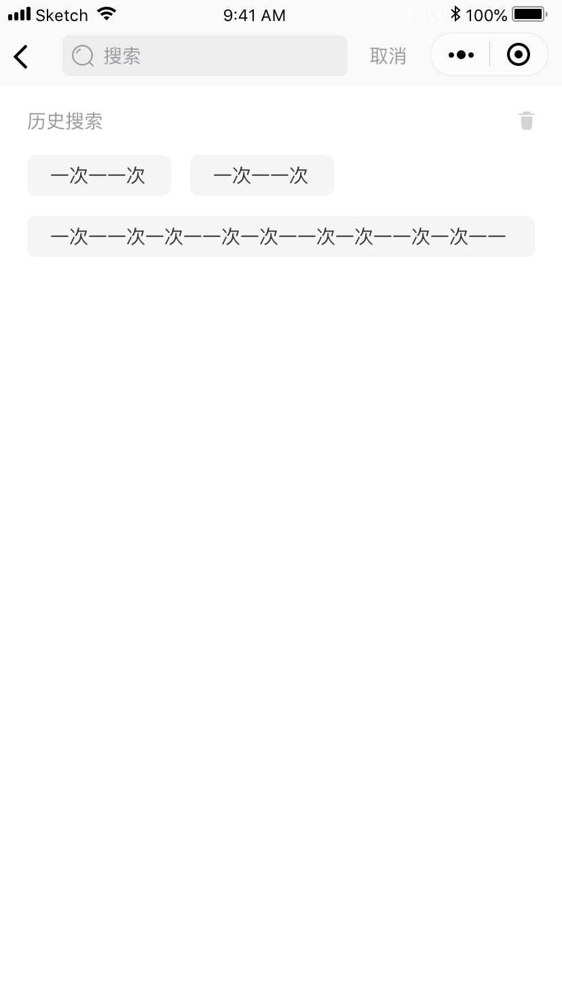
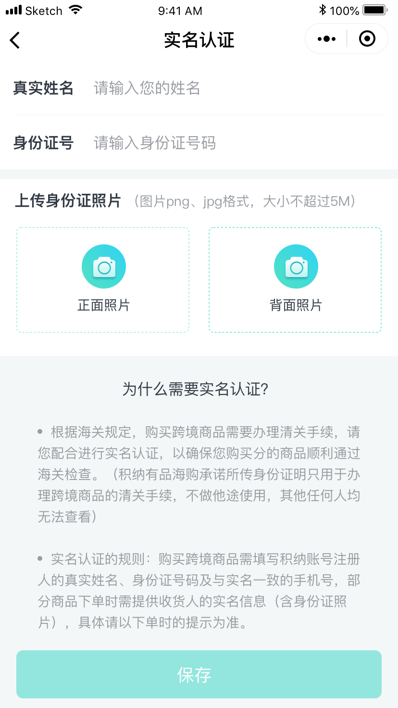

# One-sided approach [积纳有品](https://github.com/28468/Accumulate-good-products/tree/liubinbin)

> ​One-sided approach 是积纳有品 设计的 小程序。项目是基于 mpvue。

##功能列表
- [x] 首页
  - [x] 分类列表
  - [x] 搜索
  - [x] 专题页面
- [x] 购物车
  - [x] 购物车列表
  - [x] 支付
- [x] 我的
  - [x] 收货地址
  - [x] 我的优惠券
  - [x] 联系客服
  - [x] 我的订单

## One-sided approach Screenshots

|         首页        |         个人中心        |         专题        |
| :------------------: | :----------------------: | :------------------: |
|  |  |  |

|         添加收货地址         |          搜索          |            商品详情           | 
| :-------------------: | :-------------------------: | :----------------------------: |
|  |  |  |

|         商品详情弹出层         |          实名认证          |            购物车           | 
| :-------------------: | :-------------------------: | :----------------------------: |
|  |  |  |

## End

> - 喜欢 One-sided approach，帮忙点个 Star 吧!
> - 作者还会不断更新， 您的支持是作者不断更新的动力!
> - Thanks!

## About Me

> Name: 斌少
>
> QQ: 799770735
>
> Email：700770735@qq.com